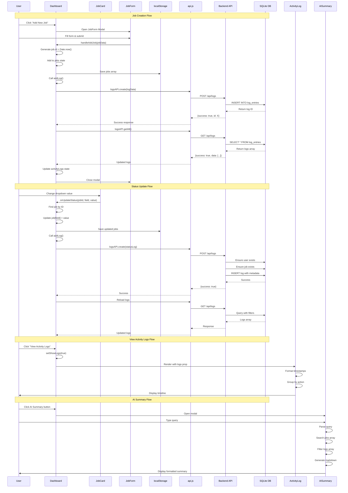
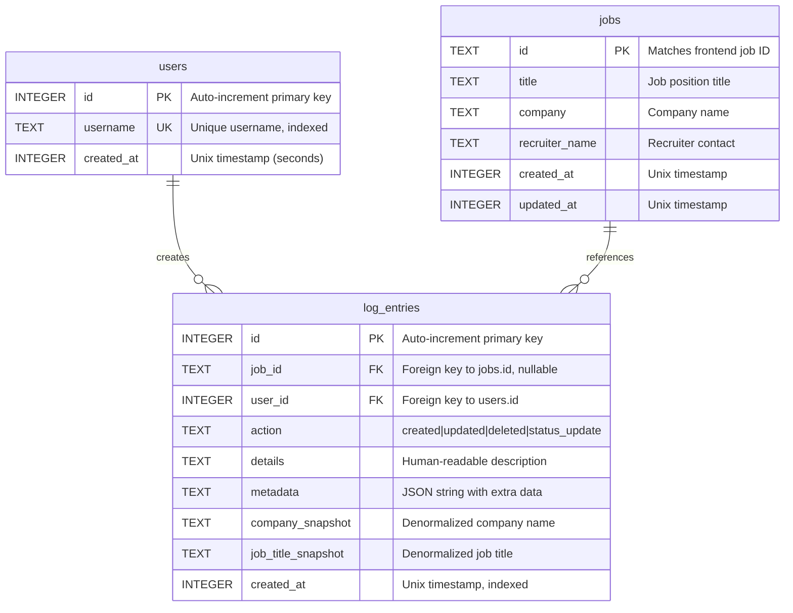

# Job Search Tracker - Comprehensive Architecture Documentation

## Table of Contents
1. [System Overview](#system-overview)
2. [Architecture Diagrams](#architecture-diagrams)
3. [Frontend Architecture](#frontend-architecture)
4. [Backend Architecture](#backend-architecture)
5. [Data Flow Patterns](#data-flow-patterns)
6. [Component Deep Dive](#component-deep-dive)
7. [Database Schema](#database-schema)
8. [API Specifications](#api-specifications)
9. [State Management](#state-management)
10. [Performance Optimizations](#performance-optimizations)

---

## System Overview

### High-Level Architecture

The Job Search Tracker is a full-stack application built with a **React SPA frontend** and a **Node.js/Express REST API backend**. It employs a **hybrid storage strategy** where job data resides in browser localStorage for quick access, while activity logs are persisted in a SQLite database for durability and advanced querying capabilities.

**Key Architectural Characteristics:**
- **Separation of Concerns**: Clear boundaries between presentation, business logic, and data layers
- **Component-Based UI**: Modular React components with single responsibilities
- **RESTful API**: Standard HTTP methods for CRUD operations
- **Optimistic UI Updates**: Immediate feedback with async persistence
- **Theme-Aware Design**: Context-based theming with dark/light modes
- **Animation-First UX**: Framer Motion for smooth transitions and micro-interactions

### Technology Stack Deep Dive

#### Frontend Stack
```
React 18.2.0
├── Core Library: Component-based UI with hooks
├── Virtual DOM: Efficient rendering and reconciliation
├── Concurrent Features: Automatic batching, transitions
└── StrictMode: Development-time checks

Vite 5.0.0
├── ES Module-based dev server
├── Hot Module Replacement (HMR)
├── Optimized production builds with Rollup
└── Fast cold starts (~200ms)

Framer Motion 10.16.4
├── Declarative animations
├── Layout animations
├── Gesture recognition
├── SVG path animations
└── Shared layout transitions

Tailwind CSS 3.3.5
├── Utility-first CSS framework
├── JIT (Just-In-Time) compiler
├── Custom design system
├── Dark mode support
└── Responsive design utilities

Lucide React 0.294.0
├── 1000+ SVG icons
├── Tree-shakeable
├── Customizable size/color
└── Consistent design language
```

#### Backend Stack
```
Node.js (ES Modules)
├── Event-driven architecture
├── Non-blocking I/O
├── V8 JavaScript engine
└── Native ES module support

Express 4.18.2
├── Minimalist web framework
├── Middleware pipeline
├── Routing system
└── Error handling

better-sqlite3 9.2.2
├── Synchronous API (simpler code)
├── Native C++ bindings (fast)
├── Prepared statements
├── Transaction support
└── WAL mode support

CORS 2.8.5
├── Cross-Origin Resource Sharing
├── Configurable origins
├── Credentials support
└── Preflight handling

dotenv 16.3.1
├── Environment variable management
├── .env file parsing
└── Development/production configs
```

---

## Architecture Diagrams

### System Architecture Diagram

```mermaid
graph TB
    subgraph "Browser Environment"
        subgraph "React Application"
            A[main.jsx<br/>Entry Point] --> B[App.jsx<br/>Root Component]
            B --> C{Authentication<br/>State}
            C -->|Not Authenticated| D[Auth Component<br/>Login/Signup]
            C -->|Authenticated| E[Dashboard Component<br/>Main Hub]
            
            subgraph "Context Providers"
                F[ThemeContext<br/>Dark/Light Mode]
            end
            
            B --> F
            F --> E
            
            subgraph "Dashboard Children"
                E --> G[JobCard<br/>×N instances]
                E --> H[JobForm<br/>Modal]
                E --> I[ActivityLog<br/>Modal]
                E --> J[AISummary<br/>Modal]
            end
            
            subgraph "Services Layer"
                K[api.js<br/>HTTP Client]
            end
            
            E --> K
            I --> K
        end
        
        subgraph "Browser Storage"
            L[(localStorage)]
            L --> M[jobTracker_jobs<br/>Job Data]
            L --> N[jobTracker_user<br/>Username]
            L --> O[jobTracker_password<br/>Password Hash]
            L --> P[jobTracker_theme<br/>Theme Preference]
        end
        
        E -.Read/Write.-> M
        D -.Read/Write.-> N
        D -.Read/Write.-> O
        F -.Read/Write.-> P
    end
    
    subgraph "Network Layer"
        Q[HTTP/REST API<br/>Port 3001]
    end
    
    K <-->|JSON| Q
    
    subgraph "Server Environment"
        subgraph "Express Application"
            R[index.js<br/>Server Entry]
            R --> S[Middleware Pipeline]
            S --> T[CORS Handler]
            S --> U[JSON Parser]
            S --> V[Request Logger]
            S --> W[Error Handler]
            
            R --> X[Routes]
            X --> Y[/api/logs<br/>Router]
            
            Y --> Z[logsController.js]
            Z --> AA[createLog]
            Z --> AB[getLogs]
            Z --> AC[getLogStats]
            Z --> AD[getLogById]
            Z --> AE[deleteLog]
            Z --> AF[bulkCreateLogs]
        end
        
        subgraph "Data Layer"
            AG[database.js<br/>SQLite Manager]
            AG --> AH[initializeDatabase]
            AG --> AI[logStore Object]
            AI --> AJ[createLog]
            AI --> AK[queryLogs]
            AI --> AL[getById]
            AI --> AM[deleteById]
            AI --> AN[getStats]
            AI --> AO[bulkInsert]
        end
        
        Z --> AI
        
        subgraph "Database"
            AP[(SQLite<br/>logs.db)]
            AP --> AQ[users table]
            AP --> AR[jobs table]
            AP --> AS[log_entries table]
            AP --> AT[Indexes]
        end
        
        AI -.SQL Queries.-> AP
    end
    
    style A fill:#e1f5ff
    style B fill:#e1f5ff
    style E fill:#fff3e0
    style K fill:#f3e5f5
    style R fill:#e8f5e9
    style AG fill:#fff9c4
    style AP fill:#ffebee
```

### Component Hierarchy Diagram

```mermaid
graph TD
    A[main.jsx] --> B[App.jsx]
    B --> C[ThemeProvider]
    C --> D{isAuthenticated?}
    
    D -->|false| E[Auth Component]
    E --> E1[Username Input]
    E --> E2[Password Input]
    E --> E3[Confirm Password Input]
    E --> E4[Submit Button]
    
    D -->|true| F[Dashboard Component]
    
    F --> G[Header Section]
    G --> G1[Logo & Title]
    G --> G2[AI Summary Button]
    G --> G3[Theme Toggle Button]
    G --> G4[Logout Button]
    
    F --> H[Stats Section]
    H --> H1[Total Applications Card]
    H --> H2[Activity Logs Card]
    H --> H3[Add New Job Button]
    
    F --> I[Search Bar]
    I --> I1[Search Input]
    I --> I2[Search Icon]
    
    F --> J[Jobs Grid]
    J --> K1[JobCard Instance 1]
    J --> K2[JobCard Instance 2]
    J --> K3[JobCard Instance N]
    
    K1 --> L[Job Header]
    L --> L1[Position Title]
    L --> L2[Company Name]
    L --> L3[Edit Button]
    L --> L4[Delete Button]
    
    K1 --> M[Recruiter Info]
    K1 --> N[Interview Stages]
    N --> N1[Recruiter Screen Dropdown]
    N --> N2[Technical Screen Dropdown]
    N --> N3[Onsite Rounds Grid]
    N3 --> N4[Round 1 Dropdown]
    N3 --> N5[Round 2 Dropdown]
    N3 --> N6[Round 3 Dropdown]
    N3 --> N7[Round 4 Dropdown]
    N --> N8[Final Decision Dropdown]
    
    K1 --> O[Notes Section]
    
    F --> P[View Logs Button]
    
    F --> Q{Modals}
    Q -->|showJobForm| R[JobForm Component]
    Q -->|showLogs| S[ActivityLog Component]
    Q -->|showAISummary| T[AISummary Component]
    
    R --> R1[Form Header]
    R --> R2[Basic Info Fields]
    R2 --> R3[Company Input]
    R2 --> R4[Position Input]
    R2 --> R5[Recruiter Input]
    R --> R6[Interview Stages Section]
    R6 --> R7[Stage Dropdowns]
    R --> R8[Notes Textarea]
    R --> R9[Action Buttons]
    R9 --> R10[Save Button]
    R9 --> R11[Cancel Button]
    
    S --> S1[Log Header]
    S --> S2[Timeline Container]
    S2 --> S3[Log Entry 1]
    S2 --> S4[Log Entry 2]
    S2 --> S5[Log Entry N]
    S3 --> S6[Action Icon]
    S3 --> S7[Log Details]
    S3 --> S8[Timestamp]
    S3 --> S9[Metadata Tags]
    S --> S10[Footer Stats]
    S10 --> S11[Created Count]
    S10 --> S12[Updated Count]
    S10 --> S13[Deleted Count]
    S10 --> S14[Status Update Count]
    
    T --> T1[AI Header]
    T --> T2[Quick Queries]
    T2 --> T3[Query Button 1]
    T2 --> T4[Query Button 2]
    T2 --> T5[Query Button 3]
    T --> T6[Response Area]
    T6 --> T7[Formatted Summary]
    T --> T8[Input Area]
    T8 --> T9[Query Input]
    T8 --> T10[Send Button]
    
    style A fill:#e3f2fd
    style B fill:#e3f2fd
    style C fill:#f3e5f5
    style F fill:#fff3e0
    style R fill:#e8f5e9
    style S fill:#fce4ec
    style T fill:#f1f8e9
```



### Data Flow Diagram



### Database Schema Diagram



---


## Frontend Architecture

### Entry Point: main.jsx

**Purpose**: Application bootstrap and React initialization

**Detailed Functionality**:
```javascript
// Creates the root React element and mounts to DOM
ReactDOM.createRoot(document.getElementById('root')).render(
  <React.StrictMode>
    <App />
  </React.StrictMode>,
)
```

**Key Responsibilities**:
1. **DOM Mounting**: Attaches React app to `#root` div in index.html
2. **StrictMode Wrapper**: Enables additional development checks:
   - Detects unsafe lifecycles
   - Warns about legacy APIs
   - Double-invokes effects to catch side effects
   - Validates ref usage
3. **Single Render**: Called once on page load

**Dependencies**:
- `react`: Core React library
- `react-dom/client`: React 18 concurrent rendering API
- `App.jsx`: Root application component
- `index.css`: Global styles (Tailwind directives)

**Performance Considerations**:
- Uses `createRoot` (React 18) for concurrent features
- Automatic batching of state updates
- Supports Suspense and transitions

---

### Root Component: App.jsx

**Purpose**: Application-level state management and routing logic

**State Management**:
```javascript
const [isAuthenticated, setIsAuthenticated] = useState(false)
const [isLoading, setIsLoading] = useState(true)
```

**Detailed Functionality**:

1. **Authentication Check** (useEffect on mount):
   ```javascript
   useEffect(() => {
     const user = localStorage.getItem('jobTracker_user')
     if (user) {
       setIsAuthenticated(true)
     }
     setIsLoading(false)
   }, [])
   ```
   - Runs once on component mount
   - Checks localStorage for existing user
   - Sets authentication state accordingly
   - Removes loading state

2. **Logout Handler**:
   ```javascript
   const handleLogout = () => {
     localStorage.removeItem('jobTracker_user')
     setIsAuthenticated(false)
   }
   ```
   - Clears user from localStorage
   - Resets authentication state
   - Triggers re-render to show Auth component

3. **Loading State**:
   - Displays animated spinner during initial check
   - Prevents flash of wrong component
   - Uses Framer Motion for smooth rotation

4. **Conditional Rendering**:
   ```javascript
   <AnimatePresence mode="wait">
     {!isAuthenticated ? (
       <Auth key="auth" onAuthenticated={() => setIsAuthenticated(true)} />
     ) : (
       <Dashboard key="dashboard" onLogout={handleLogout} />
     )}
   </AnimatePresence>
   ```
   - `mode="wait"`: Waits for exit animation before entering
   - Unique keys for proper animation transitions
   - Passes callbacks for state updates

**Props Flow**:
- **To Auth**: `onAuthenticated` callback
- **To Dashboard**: `onLogout` callback

**Context Providers**:
- Wraps entire app in `ThemeProvider`
- Makes theme state available to all descendants

**Animation Strategy**:
- Uses `AnimatePresence` for mount/unmount animations
- Smooth transitions between Auth and Dashboard
- Prevents jarring component swaps

**Error Handling**:
- No explicit error boundaries (could be improved)
- Relies on React's default error handling

---

### Context: ThemeContext.jsx

**Purpose**: Global theme state management with persistence

**Architecture Pattern**: Context API with custom hook

**State Structure**:
```javascript
{
  theme: 'dark' | 'light',
  toggleTheme: () => void
}
```

**Detailed Implementation**:

1. **Context Creation**:
   ```javascript
   const ThemeContext = createContext()
   ```
   - Creates context object
   - Default value is undefined (enforces provider usage)

2. **Custom Hook** (useTheme):
   ```javascript
   export const useTheme = () => {
     const context = useContext(ThemeContext)
     if (!context) {
       throw new Error('useTheme must be used within ThemeProvider')
     }
     return context
   }
   ```
   - Provides type-safe access to theme context
   - Throws error if used outside provider
   - Prevents common context usage mistakes

3. **Theme Initialization**:
   ```javascript
   const [theme, setTheme] = useState(() => {
     return localStorage.getItem('jobTracker_theme') || 'dark'
   })
   ```
   - Lazy initialization from localStorage
   - Defaults to 'dark' if not set
   - Runs only once on mount

4. **Theme Persistence** (useEffect):
   ```javascript
   useEffect(() => {
     localStorage.setItem('jobTracker_theme', theme)
     if (theme === 'dark') {
       document.documentElement.classList.add('dark')
     } else {
       document.documentElement.classList.remove('dark')
     }
   }, [theme])
   ```
   - Saves to localStorage on every change
   - Updates HTML class for Tailwind dark mode
   - Synchronizes with CSS framework

5. **Toggle Function**:
   ```javascript
   const toggleTheme = () => {
     setTheme(prev => prev === 'dark' ? 'light' : 'dark')
   }
   ```
   - Functional update for safety
   - Simple binary toggle
   - Triggers useEffect for persistence

**Usage Pattern**:
```javascript
// In any component
const { theme, toggleTheme } = useTheme()

// Conditional styling
className={theme === 'dark' ? 'bg-dark-card' : 'bg-white'}

// Toggle button
<button onClick={toggleTheme}>
  {theme === 'dark' ? <Sun /> : <Moon />}
</button>
```

**Performance Considerations**:
- Context value is memoized implicitly
- Only re-renders consumers when theme changes
- localStorage operations are synchronous but fast

**Tailwind Integration**:
- Uses `dark:` variant for dark mode styles
- Requires `darkMode: 'class'` in tailwind.config.js
- HTML class controls all dark mode styles

---

### Component: Auth.jsx

**Purpose**: User authentication and account creation interface

**State Management**:
```javascript
const [username, setUsername] = useState('')
const [password, setPassword] = useState('')
const [confirmPassword, setConfirmPassword] = useState('')
const [isCreatingAccount, setIsCreatingAccount] = useState(false)
const [error, setError] = useState('')
```

**Detailed Functionality**:

1. **First-Time Detection**:
   ```javascript
   useState(() => {
     const storedPassword = localStorage.getItem('jobTracker_password')
     if (!storedPassword) {
       setIsCreatingAccount(true)
     }
   }, [])
   ```
   - Checks if password exists in localStorage
   - Automatically switches to account creation mode
   - Runs once on component mount

2. **Form Validation**:
   ```javascript
   if (!username.trim()) {
     setError('Please enter a username')
     return
   }
   
   if (isCreatingAccount) {
     if (password.length < 6) {
       setError('Password must be at least 6 characters')
       return
     }
     if (password !== confirmPassword) {
       setError('Passwords do not match')
       return
     }
   }
   ```
   - Username: Required, non-empty
   - Password: Minimum 6 characters (creation only)
   - Confirm Password: Must match (creation only)
   - Sets error state for user feedback

3. **Account Creation Flow**:
   ```javascript
   localStorage.setItem('jobTracker_password', password)
   localStorage.setItem('jobTracker_user', username)
   onAuthenticated()
   ```
   - Stores plain text password (NOT SECURE - demo only)
   - Stores username
   - Calls parent callback to update auth state

4. **Login Flow**:
   ```javascript
   const storedPassword = localStorage.getItem('jobTracker_password')
   if (password === storedPassword) {
     localStorage.setItem('jobTracker_user', username)
     onAuthenticated()
   } else {
     setError('Invalid password')
   }
   ```
   - Retrieves stored password
   - Compares with input (plain text comparison)
   - Updates username on success
   - Shows error on failure

**UI Components**:

1. **Animated Container**:
   - Framer Motion scale and opacity animations
   - Glass morphism effect (backdrop-blur)
   - Gradient background
   - Hover scale effect

2. **Logo Animation**:
   ```javascript
   animate={{ rotate: [0, 10, -10, 0] }}
   transition={{ duration: 2, repeat: Infinity, repeatDelay: 3 }}
   ```
   - Periodic wiggle animation
   - Draws attention to branding
   - Adds personality to UI

3. **Input Fields**:
   - Icon prefixes (User, Lock)
   - Placeholder text
   - Focus ring styling
   - Transparent background with blur

4. **Error Display**:
   - Conditional rendering based on error state
   - Slide-in animation
   - Red color scheme
   - Semi-transparent background

**Security Considerations** (Current Implementation):
⚠️ **NOT PRODUCTION READY**:
- Passwords stored in plain text
- No encryption or hashing
- No server-side validation
- No rate limiting
- No session management
- Vulnerable to XSS attacks

**Recommended Improvements**:
- Hash passwords with bcrypt
- Use JWT tokens
- Implement server-side authentication
- Add HTTPS requirement
- Implement CSRF protection
- Add rate limiting
- Use secure, httpOnly cookies

**Accessibility**:
- Form labels for screen readers
- Keyboard navigation support
- Focus management
- Error announcements

---

### Component: Dashboard.jsx

**Purpose**: Main application hub - orchestrates all job tracking functionality

**State Management** (Complex):
```javascript
const [jobs, setJobs] = useState([])                    // Job applications array
const [activityLogs, setActivityLogs] = useState([])    // Activity logs from API
const [showJobForm, setShowJobForm] = useState(false)   // JobForm modal visibility
const [editingJob, setEditingJob] = useState(null)      // Job being edited
const [showLogs, setShowLogs] = useState(false)         // ActivityLog modal visibility
const [showAISummary, setShowAISummary] = useState(false) // AISummary modal visibility
const [searchQuery, setSearchQuery] = useState('')      // Search filter text
```

**Data Initialization** (useEffect):
```javascript
useEffect(() => {
  // 1. Load jobs from localStorage
  const savedJobs = localStorage.getItem('jobTracker_jobs')
  if (savedJobs) {
    const parsed = JSON.parse(savedJobs).map(normalizeJob)
    setJobs(parsed)
    localStorage.setItem('jobTracker_jobs', JSON.stringify(parsed))
  }

  // 2. Load logs from backend API
  loadLogsFromAPI()
}, [])
```

**Key Functions**:

1. **loadLogsFromAPI** (Async):
   ```javascript
   const loadLogsFromAPI = async () => {
     try {
       const response = await logsAPI.getAll()
       if (response.success && response.data) {
         const sortedLogs = [...response.data].sort(
           (a, b) => new Date(b.timestamp) - new Date(a.timestamp)
         )
         setActivityLogs(sortedLogs)
       }
     } catch (error) {
       console.error('Failed to load logs from API, using localStorage fallback:', error)
       // Fallback to localStorage if API fails
       const savedLogs = localStorage.getItem('jobTracker_logs')
       if (savedLogs) {
         const parsedLogs = JSON.parse(savedLogs).sort(
           (a, b) => new Date(b.timestamp) - new Date(a.timestamp)
         )
         setActivityLogs(parsedLogs)
       }
     }
   }
   ```
   - Fetches all logs from backend
   - Sorts by timestamp (newest first)
   - Graceful fallback to localStorage
   - Error handling with console logging

2. **saveJobs** (Helper):
   ```javascript
   const saveJobs = (newJobs) => {
     const normalizedList = newJobs.map(normalizeJob)
     setJobs(normalizedList)
     localStorage.setItem('jobTracker_jobs', JSON.stringify(normalizedList))
   }
   ```
   - Normalizes job objects (ensures all fields exist)
   - Updates React state
   - Persists to localStorage
   - Single source of truth for job updates

3. **addLog** (Async):
   ```javascript
   const addLog = async ({ action, job, details, metadata }) => {
     const username = localStorage.getItem('jobTracker_user')
     const logData = {
       timestamp: new Date().toISOString(),
       action,
       jobId: job?.id,
       jobTitle: job?.position,
       company: job?.company,
       recruiterName: job?.recruiterName,
       details,
       metadata,
       username
     }

     try {
       // Save to backend API
       await logsAPI.create(logData)
       // Reload logs from API to get the latest data with ID
       await loadLogsFromAPI()
     } catch (error) {
       console.error('Failed to save log to API, using localStorage fallback:', error)
       // Fallback to localStorage if API fails
       const newLog = {
         id: Date.now(),
         ...logData
       }
       const newLogs = [newLog, ...activityLogs]
       setActivityLogs(newLogs)
       localStorage.setItem('jobTracker_logs', JSON.stringify(newLogs))
     }
   }
   ```
   - Creates log entry with full context
   - Attempts backend persistence first
   - Reloads all logs to get server-assigned ID
   - Falls back to localStorage on failure
   - Maintains log history even if backend is down

4. **handleAddJob**:
   ```javascript
   const handleAddJob = (jobData) => {
     if (editingJob) {
       // Update existing job
       const updatedJobs = jobs.map(job =>
         job.id === editingJob.id ? { ...jobData, id: job.id } : job
       )
       saveJobs(updatedJobs)
       addLog({
         action: 'updated',
         job: { ...editingJob, ...jobData },
         details: 'Job details updated'
       })
     } else {
       // Create new job
       const newJob = { 
         ...jobData, 
         id: Date.now(), 
         createdAt: new Date().toISOString() 
       }
       saveJobs([...jobs, newJob])
       addLog({
         action: 'created',
         job: newJob,
         details: 'New job application added'
       })
     }
     setShowJobForm(false)
     setEditingJob(null)
   }
   ```
   - Handles both create and update operations
   - Generates unique ID using timestamp
   - Logs action to activity log
   - Closes modal and resets editing state

5. **handleEditJob**:
   ```javascript
   const handleEditJob = (job) => {
     setEditingJob(job)
     setShowJobForm(true)
   }
   ```
   - Sets job to edit
   - Opens JobForm modal
   - JobForm will pre-populate with job data

6. **handleDeleteJob**:
   ```javascript
   const handleDeleteJob = (jobId) => {
     const job = jobs.find(j => j.id === jobId)
     const updatedJobs = jobs.filter(j => j.id !== jobId)
     saveJobs(updatedJobs)
     if (job) {
       addLog({
         action: 'deleted',
         job,
         details: 'Job application removed'
       })
     }
   }
   ```
   - Finds job before deletion (for logging)
   - Filters out deleted job
   - Saves updated array
   - Logs deletion action

7. **handleUpdateJobStatus**:
   ```javascript
   const handleUpdateJobStatus = (jobId, field, value) => {
     const job = jobs.find(j => j.id === jobId)
     const updatedJobs = jobs.map(j =>
       j.id === jobId ? { ...j, [field]: value } : j
     )
     saveJobs(updatedJobs)
     if (job) {
       addLog({
         action: 'status_update',
         job,
         details: `${field} updated to: ${value}`,
         metadata: { field, value }
       })
     }
   }
   ```
   - Updates single field on job
   - Logs status change with metadata
   - Metadata includes field name and new value
   - Enables detailed activity tracking

**Search Functionality**:
```javascript
const filteredJobs = jobs.filter(job =>
  job.company.toLowerCase().includes(searchQuery.toLowerCase()) ||
  job.position.toLowerCase().includes(searchQuery.toLowerCase()) ||
  (job.recruiterName || '').toLowerCase().includes(searchQuery.toLowerCase())
)
```
- Case-insensitive search
- Searches across company, position, recruiter
- Real-time filtering as user types
- Handles undefined recruiterName gracefully

**UI Structure**:

1. **Header**:
   - Logo with wiggle animation
   - Welcome message with username
   - AI Summary button
   - Theme toggle button
   - Logout button

2. **Stats Cards**:
   - Total Applications count
   - Activity Logs count
   - Add New Job button (styled as card)
   - Staggered entrance animations

3. **Search Bar**:
   - Full-width input
   - Search icon prefix
   - Placeholder text
   - Real-time filtering

4. **Jobs Grid**:
   - 2-column layout on large screens
   - 1-column on mobile
   - AnimatePresence for smooth add/remove
   - Staggered entrance animations (index * 0.1 delay)

5. **View Logs Button**:
   - Full-width at bottom
   - Shows log count
   - Opens ActivityLog modal

6. **Modals** (Conditional):
   - JobForm (add/edit)
   - ActivityLog (view history)
   - AISummary (query interface)

**Performance Optimizations**:
- Jobs stored in state (no prop drilling)
- Memoization opportunities (not currently implemented)
- Lazy loading of modals (conditional rendering)
- Efficient filtering with Array.filter

**Data Flow**:
```
User Action → Event Handler → State Update → localStorage → API Call → State Reload
```

**Error Handling**:
- Try-catch blocks for API calls
- Fallback to localStorage
- Console error logging
- Graceful degradation

---


### Component: JobCard.jsx

**Purpose**: Display and manage individual job application with inline editing

**Props Interface**:
```typescript
interface JobCardProps {
  job: Job                                    // Job data object
  index: number                               // Position in list (for animation delay)
  onEdit: (job: Job) => void                 // Edit callback
  onDelete: (jobId: number) => void          // Delete callback
  onUpdateStatus: (jobId, field, value) => void  // Status update callback
  theme: 'dark' | 'light'                    // Current theme
}
```

**Job Data Structure**:
```typescript
interface Job {
  id: number                    // Unique identifier (timestamp)
  company: string               // Company name
  position: string              // Job title
  recruiterName: string         // Recruiter contact
  recruiterScreen: Status       // Recruiter interview status
  technicalScreen: Status       // Technical interview status
  onsiteRound1: RoundStatus     // On-site round 1 status
  onsiteRound2: RoundStatus     // On-site round 2 status
  onsiteRound3: RoundStatus     // On-site round 3 status
  onsiteRound4: RoundStatus     // On-site round 4 status
  decision: Decision            // Final decision status
  notes?: string                // Optional notes
  createdAt: string             // ISO timestamp
}

type Status = 'Not Started' | 'In Progress' | 'Completed' | 'Rejected'
type RoundStatus = 'Not Started' | 'Scheduled' | 'Completed' | 'Passed' | 'Failed'
type Decision = 'Pending' | 'Offer Extended' | 'Accepted' | 'Rejected' | 'Declined'
```

**Helper Functions**:

1. **getStatusColor**:
   ```javascript
   const getStatusColor = (status) => {
     switch (status) {
       case 'Completed':
       case 'Passed':
         return 'text-green-500'
       case 'In Progress':
       case 'Scheduled':
         return 'text-yellow-500'
       case 'Rejected':
       case 'Failed':
         return 'text-red-500'
       default:
         return theme === 'dark' ? 'text-dark-muted' : 'text-light-muted'
     }
   }
   ```
   - Maps status to color class
   - Semantic color coding (green=success, yellow=pending, red=failure)
   - Theme-aware default color

2. **getStatusIcon**:
   ```javascript
   const getStatusIcon = (status) => {
     switch (status) {
       case 'Completed':
       case 'Passed':
         return <CheckCircle className="w-4 h-4" />
       case 'In Progress':
       case 'Scheduled':
         return <Clock className="w-4 h-4" />
       default:
         return <Circle className="w-4 h-4" />
     }
   }
   ```
   - Visual indicator for status
   - Consistent iconography
   - Improves scannability

**UI Structure**:

1. **Card Container**:
   ```javascript
   <motion.div
     initial={{ opacity: 0, y: 20 }}
     animate={{ opacity: 1, y: 0 }}
     exit={{ opacity: 0, scale: 0.9 }}
     transition={{ delay: index * 0.1 }}
     whileHover={{ y: -5 }}
   >
   ```
   - Entrance animation with stagger
   - Exit animation with scale
   - Hover lift effect
   - Theme-aware background and border

2. **Header Section**:
   - Position title (large, bold)
   - Company name with building icon
   - Edit button (blue)
   - Delete button (red)
   - Hover scale animations on buttons

3. **Recruiter Info**:
   - User icon prefix
   - Recruiter name display
   - Muted text color

4. **Interview Stages**:
   
   a. **Recruiter Screen**:
   ```javascript
   <motion.div whileHover={{ scale: 1.02 }}>
     <div className="flex items-center justify-between">
       <span>Recruiter Screen</span>
       <span className={getStatusColor(job.recruiterScreen)}>
         {getStatusIcon(job.recruiterScreen)}
         <span>{job.recruiterScreen}</span>
       </span>
     </div>
     <select
       value={job.recruiterScreen}
       onChange={(e) => onUpdateStatus(job.id, 'recruiterScreen', e.target.value)}
     >
       {statusOptions.map(option => (
         <option key={option} value={option}>{option}</option>
       ))}
     </select>
   </motion.div>
   ```
   - Status display with icon and color
   - Dropdown for inline editing
   - Immediate update on change
   - Hover scale effect

   b. **Technical Screen**:
   - Same structure as Recruiter Screen
   - Different field name

   c. **On-site Rounds**:
   ```javascript
   <div className="space-y-2">
     {['onsiteRound1', 'onsiteRound2', 'onsiteRound3', 'onsiteRound4'].map((round, idx) => (
       <div key={round} className="flex items-center justify-between">
         <span>Round {idx + 1}</span>
         <select
           value={job[round]}
           onChange={(e) => onUpdateStatus(job.id, round, e.target.value)}
         >
           {roundOptions.map(option => (
             <option key={option} value={option}>{option}</option>
           ))}
         </select>
       </div>
     ))}
   </div>
   ```
   - 4 rounds in compact grid
   - Smaller dropdowns
   - Dynamic field access with bracket notation

   d. **Final Decision**:
   - Same structure as interview screens
   - Different status options
   - Most important status (visually emphasized)

5. **Notes Section** (Conditional):
   ```javascript
   {job.notes && (
     <motion.div
       initial={{ opacity: 0 }}
       animate={{ opacity: 1 }}
     >
       <p><span className="font-semibold">Notes:</span> {job.notes}</p>
     </motion.div>
   )}
   ```
   - Only renders if notes exist
   - Fade-in animation
   - Muted background
   - Preserves whitespace

**Interaction Patterns**:

1. **Edit Flow**:
   - User clicks edit button
   - `onEdit(job)` called
   - Dashboard opens JobForm with job data
   - User modifies and saves
   - Card updates automatically (state change)

2. **Delete Flow**:
   - User clicks delete button
   - `onDelete(job.id)` called
   - Dashboard removes from state
   - Exit animation plays
   - Card disappears

3. **Status Update Flow**:
   - User changes dropdown
   - `onChange` fires immediately
   - `onUpdateStatus(jobId, field, value)` called
   - Dashboard updates state
   - Saves to localStorage
   - Creates activity log
   - Card re-renders with new status

**Animation Strategy**:
- **Entrance**: Fade + slide up with stagger
- **Exit**: Fade + scale down
- **Hover**: Lift effect (translateY)
- **Stage Hover**: Subtle scale
- **Smooth**: All transitions use Framer Motion

**Accessibility**:
- Semantic HTML (select elements)
- Keyboard navigation (native dropdowns)
- Color + icon for status (not color alone)
- Sufficient contrast ratios

**Performance**:
- No unnecessary re-renders (pure component candidate)
- Efficient event handlers (no inline functions in loops)
- Conditional rendering for notes

---

### Component: JobForm.jsx

**Purpose**: Modal form for creating and editing job applications

**Props Interface**:
```typescript
interface JobFormProps {
  job?: Job | null              // Job to edit (null for create)
  onSave: (jobData: Job) => void   // Save callback
  onClose: () => void           // Close modal callback
  theme: 'dark' | 'light'       // Current theme
}
```

**State Management**:
```javascript
const [formData, setFormData] = useState(job || {
  company: '',
  recruiterName: '',
  position: '',
  recruiterScreen: 'Not Started',
  technicalScreen: 'Not Started',
  onsiteRound1: 'Not Started',
  onsiteRound2: 'Not Started',
  onsiteRound3: 'Not Started',
  onsiteRound4: 'Not Started',
  decision: 'Pending',
  notes: ''
})
```
- Initializes with job data (edit mode) or defaults (create mode)
- Single state object for all fields
- Controlled inputs

**Key Functions**:

1. **handleSubmit**:
   ```javascript
   const handleSubmit = (e) => {
     e.preventDefault()
     onSave(formData)
   }
   ```
   - Prevents default form submission
   - Calls parent callback with form data
   - Parent handles state update and persistence

2. **handleChange**:
   ```javascript
   const handleChange = (field, value) => {
     setFormData(prev => ({ ...prev, [field]: value }))
   }
   ```
   - Generic field updater
   - Immutable state update
   - Dynamic field access

**UI Structure**:

1. **Modal Overlay**:
   ```javascript
   <motion.div
     initial={{ opacity: 0 }}
     animate={{ opacity: 1 }}
     exit={{ opacity: 0 }}
     className="fixed inset-0 bg-black/50 backdrop-blur-sm"
     onClick={onClose}
   >
   ```
   - Full-screen overlay
   - Semi-transparent black
   - Backdrop blur effect
   - Click to close

2. **Modal Container**:
   ```javascript
   <motion.div
     initial={{ scale: 0.9, y: 20 }}
     animate={{ scale: 1, y: 0 }}
     exit={{ scale: 0.9, y: 20 }}
     onClick={(e) => e.stopPropagation()}
   >
   ```
   - Scale + slide animation
   - Stops propagation (prevents close on content click)
   - Max width constraint
   - Scrollable content

3. **Header**:
   - Dynamic title (Add vs Edit)
   - Close button with rotate animation
   - Sticky positioning
   - Border bottom

4. **Form Sections**:

   a. **Basic Info** (Grid Layout):
   ```javascript
   <div className="grid grid-cols-1 md:grid-cols-2 gap-4">
     <div>
       <label>Company Name *</label>
       <input
         type="text"
         required
         value={formData.company}
         onChange={(e) => handleChange('company', e.target.value)}
       />
     </div>
     <div>
       <label>Position *</label>
       <input
         type="text"
         required
         value={formData.position}
         onChange={(e) => handleChange('position', e.target.value)}
       />
     </div>
   </div>
   ```
   - 2-column on desktop, 1-column on mobile
   - Required fields marked with *
   - HTML5 validation

   b. **Recruiter Name**:
   - Full-width input
   - Required field

   c. **Interview Stages**:
   ```javascript
   <div className="space-y-4">
     <h3>Interview Stages</h3>
     
     {/* Recruiter Screen */}
     <select
       value={formData.recruiterScreen}
       onChange={(e) => handleChange('recruiterScreen', e.target.value)}
     >
       {['Not Started', 'In Progress', 'Completed', 'Rejected'].map(option => (
         <option key={option} value={option}>{option}</option>
       ))}
     </select>
     
     {/* Technical Screen */}
     <select
       value={formData.technicalScreen}
       onChange={(e) => handleChange('technicalScreen', e.target.value)}
     >
       {/* Same options */}
     </select>
     
     {/* On-site Rounds */}
     <div className="grid grid-cols-2 gap-3">
       {[1, 2, 3, 4].map(num => (
         <div key={num}>
           <label>Round {num}</label>
           <select
             value={formData[`onsiteRound${num}`]}
             onChange={(e) => handleChange(`onsiteRound${num}`, e.target.value)}
           >
             {['Not Started', 'Scheduled', 'Completed', 'Passed', 'Failed'].map(option => (
               <option key={option} value={option}>{option}</option>
             ))}
           </select>
         </div>
       ))}
     </div>
     
     {/* Final Decision */}
     <select
       value={formData.decision}
       onChange={(e) => handleChange('decision', e.target.value)}
     >
       {['Pending', 'Offer Extended', 'Accepted', 'Rejected', 'Declined'].map(option => (
         <option key={option} value={option}>{option}</option>
       ))}
     </select>
   </div>
   ```
   - Grouped logically
   - Different status options per stage
   - 2x2 grid for on-site rounds

   d. **Notes**:
   ```javascript
   <textarea
     value={formData.notes}
     onChange={(e) => handleChange('notes', e.target.value)}
     rows={4}
     className="resize-none"
   />
   ```
   - Multi-line text input
   - Fixed height (4 rows)
   - No resize handle
   - Optional field

5. **Action Buttons**:
   ```javascript
   <div className="flex space-x-3">
     <motion.button
       type="submit"
       whileHover={{ scale: 1.02 }}
       whileTap={{ scale: 0.98 }}
     >
       {job ? 'Update Job' : 'Add Job'}
     </motion.button>
     <motion.button
       type="button"
       whileHover={{ scale: 1.02 }}
       whileTap={{ scale: 0.98 }}
       onClick={onClose}
     >
       Cancel
     </motion.button>
   </div>
   ```
   - Submit button (gradient, primary)
   - Cancel button (secondary)
   - Dynamic submit text
   - Hover/tap animations

**Validation Strategy**:
- HTML5 required attributes
- Browser native validation
- No custom validation logic
- Could be enhanced with:
  - Email validation for recruiter
  - URL validation for company website
  - Character limits
  - Custom error messages

**Accessibility**:
- Form semantics (form, label, input)
- Required field indicators
- Keyboard navigation
- Focus management (could be improved)
- ARIA labels (could be added)

**UX Considerations**:
- Pre-populated in edit mode
- Clear visual hierarchy
- Logical field grouping
- Responsive layout
- Smooth animations
- Click outside to close
- Escape key to close (not implemented)

---

### Component: ActivityLog.jsx

**Purpose**: Display chronological timeline of all job-related activities

**Props Interface**:
```typescript
interface ActivityLogProps {
  logs: Log[]                   // Array of activity logs
  jobs: Job[]                   // Array of jobs (unused currently)
  onClose: () => void           // Close modal callback
  theme: 'dark' | 'light'       // Current theme
}
```

**Log Data Structure**:
```typescript
interface Log {
  id: number                    // Unique identifier
  timestamp: string             // ISO timestamp
  action: 'created' | 'updated' | 'deleted' | 'status_update'
  jobId: number                 // Related job ID
  jobTitle: string              // Job position
  company: string               // Company name
  details: string               // Human-readable description
  username: string              // User who performed action
  metadata?: {                  // Optional extra data
    field?: string              // Field that changed
    value?: string              // New value
    [key: string]: any
  }
}
```

**Helper Functions**:

1. **getActionIcon**:
   ```javascript
   const getActionIcon = (action) => {
     switch (action) {
       case 'created':
         return <Plus className="w-4 h-4" />
       case 'updated':
         return <Edit className="w-4 h-4" />
       case 'deleted':
         return <Trash2 className="w-4 h-4" />
       case 'status_update':
         return <TrendingUp className="w-4 h-4" />
       default:
         return <Clock className="w-4 h-4" />
     }
   }
   ```
   - Maps action type to icon
   - Consistent visual language
   - Improves scannability

2. **getActionColor**:
   ```javascript
   const getActionColor = (action) => {
     switch (action) {
       case 'created':
         return 'bg-green-500'
       case 'updated':
         return 'bg-blue-500'
       case 'deleted':
         return 'bg-red-500'
       case 'status_update':
         return 'bg-purple-500'
       default:
         return 'bg-gray-500'
     }
   }
   ```
   - Semantic color coding
   - Used for icon background
   - Consistent with app theme

3. **formatDate**:
   ```javascript
   const formatDate = (dateString) => {
     const date = new Date(dateString)
     const now = new Date()
     const diffMs = now - date
     const diffMins = Math.floor(diffMs / 60000)
     const diffHours = Math.floor(diffMs / 3600000)
     const diffDays = Math.floor(diffMs / 86400000)

     if (diffMins < 1) return 'Just now'
     if (diffMins < 60) return `${diffMins} minutes ago`
     if (diffHours < 24) return `${diffHours} hours ago`
     if (diffDays < 7) return `${diffDays} days ago`

     return date.toLocaleDateString('en-US', {
       month: 'short',
       day: 'numeric',
       year: 'numeric',
       hour: '2-digit',
       minute: '2-digit'
     })
   }
   ```
   - Relative time for recent activities
   - Absolute time for older activities
   - Human-readable format
   - Improves context understanding

**UI Structure**:

1. **Modal Overlay & Container**:
   - Same pattern as JobForm
   - Full-screen overlay
   - Centered modal
   - Click outside to close

2. **Header**:
   ```javascript
   <div className="p-6 flex items-center justify-between">
     <div>
       <h2>Activity Logs</h2>
       <p>{logs.length} total activities</p>
     </div>
     <button onClick={onClose}>
       <X />
     </button>
   </div>
   ```
   - Title and count
   - Close button
   - Border bottom

3. **Timeline Container**:
   ```javascript
   <div className="flex-1 overflow-y-auto p-6">
     {logs.length === 0 ? (
       <div className="text-center py-12">
         <Clock className="w-12 h-12 mx-auto mb-3 opacity-50" />
         <p>No activity logs yet</p>
       </div>
     ) : (
       <div className="space-y-4">
         {logs.map((log, index) => (
           <LogEntry key={log.id} log={log} index={index} />
         ))}
       </div>
     )}
   </div>
   ```
   - Scrollable area
   - Empty state with icon
   - Vertical spacing between entries

4. **Log Entry**:
   ```javascript
   <motion.div
     key={log.id}
     initial={{ opacity: 0, x: -20 }}
     animate={{ opacity: 1, x: 0 }}
     transition={{ delay: index * 0.05 }}
     className="relative"
   >
     {/* Timeline line */}
     {index !== logs.length - 1 && (
       <div className="absolute left-4 top-12 bottom-0 w-0.5 bg-border" />
     )}

     <div className="flex space-x-4">
       {/* Icon */}
       <motion.div
         whileHover={{ scale: 1.1 }}
         className={`${getActionColor(log.action)} w-8 h-8 rounded-full`}
       >
         {getActionIcon(log.action)}
       </motion.div>

       {/* Content */}
       <motion.div whileHover={{ scale: 1.01 }} className="flex-1">
         <div className="flex items-start justify-between">
           <div>
             <h4>{log.jobTitle} at {log.company}</h4>
             <p>{log.details}</p>
             {log.metadata && (
               <div className="mt-2 flex flex-wrap gap-2">
                 {Object.entries(log.metadata).map(([key, value]) => (
                   <span key={key} className="px-2 py-0.5 rounded-full border">
                     <strong>{key}:</strong> {String(value)}
                   </span>
                 ))}
               </div>
             )}
           </div>
           <span className="text-xs">{formatDate(log.timestamp)}</span>
         </div>

         <div className="flex items-center justify-between text-xs">
           <span>by {log.username}</span>
           <span className="px-2 py-1 rounded">
             {log.action.replace('_', ' ')}
           </span>
         </div>
       </motion.div>
     </div>
   </motion.div>
   ```
   - Timeline line connects entries
   - Colored icon circle
   - Job and company name
   - Details text
   - Metadata tags (if present)
   - Relative timestamp
   - Username attribution
   - Action type badge

5. **Footer Stats**:
   ```javascript
   <div className="grid grid-cols-4 gap-4 text-center">
     {['created', 'updated', 'deleted', 'status_update'].map(action => {
       const count = logs.filter(log => log.action === action).length
       return (
         <motion.div key={action} whileHover={{ scale: 1.05 }}>
           <div className={`${getActionColor(action)} w-8 h-8 rounded-full`}>
             {getActionIcon(action)}
           </div>
           <p className="text-xl font-bold">{count}</p>
           <p className="text-xs">{action.replace('_', ' ')}</p>
         </motion.div>
       )
     })}
   </div>
   ```
   - 4-column grid
   - Count per action type
   - Icon, number, label
   - Hover scale effect

**Animation Strategy**:
- **Entrance**: Staggered slide from left
- **Hover**: Subtle scale on entries
- **Icon Hover**: Scale up
- **Smooth**: 50ms delay between entries

**Data Processing**:
- Logs pre-sorted by Dashboard (newest first)
- No filtering in component
- Could add:
  - Date range filter
  - Action type filter
  - Company filter
  - Search functionality

**Performance**:
- Efficient rendering (no complex calculations)
- Could benefit from virtualization for 1000+ logs
- Memoization opportunities for stats calculation

---


### Component: AISummary.jsx

**Purpose**: Provide intelligent query interface for job search data analysis

**Props Interface**:
```typescript
interface AISummaryProps {
  logs: Log[]                   // Activity logs array
  jobs: Job[]                   // Jobs array
  onClose: () => void           // Close modal callback
  theme: 'dark' | 'light'       // Current theme
}
```

**State Management**:
```javascript
const [query, setQuery] = useState('')           // User's query text
const [response, setResponse] = useState('')     // Generated summary
const [isLoading, setIsLoading] = useState(false) // Loading state
```

**Core Function: generateSummary**

This is a **rule-based query processor** (not actual AI/ML):

```javascript
const generateSummary = (searchQuery) => {
  setIsLoading(true)

  // Simulate AI processing delay
  setTimeout(() => {
    const lowerQuery = searchQuery.toLowerCase()

    // 1. Company-Specific Query
    const companyMatch = jobs.find(job =>
      job.company.toLowerCase().includes(lowerQuery) ||
      lowerQuery.includes(job.company.toLowerCase())
    )

    if (companyMatch) {
      // Generate detailed company summary
      const companyLogs = logs.filter(log =>
        log.company.toLowerCase() === companyMatch.company.toLowerCase()
      )

      let summary = `## Summary for ${companyMatch.company}\n\n`
      summary += `**Position:** ${companyMatch.position}\n`
      summary += `**Recruiter:** ${companyMatch.recruiterName}\n\n`
      
      // Current status section
      summary += `### Current Status\n`
      summary += `- **Recruiter Screen:** ${companyMatch.recruiterScreen}\n`
      summary += `- **Technical Screen:** ${companyMatch.technicalScreen}\n`
      summary += `- **On-site Round 1:** ${companyMatch.onsiteRound1}\n`
      summary += `- **On-site Round 2:** ${companyMatch.onsiteRound2}\n`
      summary += `- **On-site Round 3:** ${companyMatch.onsiteRound3}\n`
      summary += `- **On-site Round 4:** ${companyMatch.onsiteRound4}\n`
      summary += `- **Decision:** ${companyMatch.decision}\n\n`

      // Notes section
      if (companyMatch.notes) {
        summary += `### Notes\n${companyMatch.notes}\n\n`
      }

      // Recent activity section
      if (companyLogs.length > 0) {
        summary += `### Recent Activity (${companyLogs.length} updates)\n\n`

        const recentLogs = companyLogs.slice(0, 5)
        recentLogs.forEach((log, idx) => {
          const date = new Date(log.timestamp).toLocaleDateString('en-US', {
            month: 'short',
            day: 'numeric',
            hour: '2-digit',
            minute: '2-digit'
          })
          summary += `${idx + 1}. **${date}** - ${log.details}\n`
        })

        if (companyLogs.length > 5) {
          summary += `\n*...and ${companyLogs.length - 5} more updates*\n`
        }

        // Last update timestamp
        const lastLog = companyLogs[0]
        const lastUpdateDate = new Date(lastLog.timestamp).toLocaleDateString('en-US', {
          month: 'long',
          day: 'numeric',
          year: 'numeric',
          hour: '2-digit',
          minute: '2-digit'
        })
        summary += `\n### Last Updated\n`
        summary += `${lastUpdateDate} by ${lastLog.username}\n`
        summary += `**Action:** ${lastLog.details}`
      } else {
        summary += `### Activity\nNo updates recorded yet for this application.`
      }

      setResponse(summary)
    } 
    
    // 2. General Overview Query
    else if (lowerQuery.includes('summary') || lowerQuery.includes('overview')) {
      let summary = `## Overall Job Search Summary\n\n`
      summary += `**Total Applications:** ${jobs.length}\n`
      summary += `**Total Activities:** ${logs.length}\n\n`

      // Status breakdown
      summary += `### Application Status Breakdown\n`
      const statusCounts = {
        'In Progress': jobs.filter(j =>
          j.recruiterScreen === 'In Progress' ||
          j.technicalScreen === 'In Progress'
        ).length,
        'Completed Interviews': jobs.filter(j =>
          j.recruiterScreen === 'Completed' &&
          j.technicalScreen === 'Completed'
        ).length,
        'Rejected': jobs.filter(j =>
          j.decision === 'Rejected'
        ).length,
        'Offers': jobs.filter(j =>
          j.decision === 'Offer Extended' ||
          j.decision === 'Accepted'
        ).length
      }

      Object.entries(statusCounts).forEach(([status, count]) => {
        summary += `- **${status}:** ${count}\n`
      })

      // Recent companies
      summary += `\n### Recent Companies\n`
      const recentJobs = [...jobs].slice(-5).reverse()
      recentJobs.forEach((job, idx) => {
        summary += `${idx + 1}. **${job.company}** - ${job.position} (${job.decision})\n`
      })

      // Most active companies
      summary += `\n### Most Active Companies\n`
      const companyCounts = {}
      logs.forEach(log => {
        companyCounts[log.company] = (companyCounts[log.company] || 0) + 1
      })
      const sortedCompanies = Object.entries(companyCounts)
        .sort((a, b) => b[1] - a[1])
        .slice(0, 3)

      sortedCompanies.forEach(([company, count], idx) => {
        summary += `${idx + 1}. **${company}** - ${count} updates\n`
      })

      setResponse(summary)
    } 
    
    // 3. No Match - Help Message
    else {
      setResponse(`I couldn't find specific information about "${searchQuery}".\n\nTry asking:\n- "What's the status for [company name]?"\n- "Give me an overview"\n- "Summary of my applications"\n- "What's the latest on [company name]?"`)
    }

    setIsLoading(false)
  }, 1000) // 1 second simulated delay
}
```

**Query Processing Logic**:

1. **Company Match**:
   - Searches jobs array for company name
   - Case-insensitive partial matching
   - Bidirectional search (query in company OR company in query)
   - Generates detailed company report

2. **Overview Match**:
   - Keyword detection: "summary", "overview"
   - Aggregates statistics across all jobs
   - Calculates status breakdowns
   - Identifies most active companies

3. **No Match**:
   - Provides helpful suggestions
   - Lists example queries
   - Guides user to valid inputs

**UI Structure**:

1. **Header** (Gradient):
   ```javascript
   <div className="bg-gradient-to-r from-purple-600 to-blue-600 p-6">
     <div className="flex items-center space-x-3">
       <motion.div
         animate={{ rotate: [0, 10, -10, 0] }}
         transition={{ duration: 2, repeat: Infinity }}
       >
         <Sparkles className="w-8 h-8 text-white" />
       </motion.div>
       <div>
         <h2>AI Summary</h2>
         <p>Ask me anything about your job search</p>
       </div>
     </div>
     <button onClick={onClose}>
       <X />
     </button>
   </div>
   ```
   - Vibrant gradient background
   - Animated sparkles icon
   - Descriptive subtitle
   - Close button

2. **Quick Queries**:
   ```javascript
   const quickQueries = [
     'Give me an overview',
     'What companies am I interviewing with?',
     'Show me recent activity'
   ]

   <div className="p-4 border-b">
     <p>Try these quick queries:</p>
     <div className="flex flex-wrap gap-2">
       {quickQueries.map((quickQuery, idx) => (
         <motion.button
           key={idx}
           whileHover={{ scale: 1.05 }}
           whileTap={{ scale: 0.95 }}
           onClick={() => {
             setQuery(quickQuery)
             generateSummary(quickQuery)
           }}
         >
           {quickQuery}
         </motion.button>
       ))}
     </div>
   </div>
   ```
   - Pre-defined query buttons
   - One-click execution
   - Fills input and runs query
   - Helps with discoverability

3. **Response Area**:
   ```javascript
   <div className="flex-1 overflow-y-auto p-6">
     {response ? (
       <motion.div
         initial={{ opacity: 0, y: 20 }}
         animate={{ opacity: 1, y: 0 }}
       >
         {/* Markdown-style rendering */}
         {response.split('\n').map((line, idx) => {
           if (line.startsWith('## ')) {
             return <h2 key={idx}>{line.replace('## ', '')}</h2>
           } else if (line.startsWith('### ')) {
             return <h3 key={idx}>{line.replace('### ', '')}</h3>
           } else if (line.startsWith('**') && line.endsWith('**')) {
             return <p key={idx} className="font-semibold">
               {line.replace(/\*\*/g, '')}
             </p>
           } else if (line.trim()) {
             // Handle bold text within lines
             const parts = line.split(/(\*\*.*?\*\*)/)
             return (
               <p key={idx}>
                 {parts.map((part, i) =>
                   part.startsWith('**') && part.endsWith('**') ? (
                     <strong key={i}>{part.replace(/\*\*/g, '')}</strong>
                   ) : (
                     <span key={i}>{part}</span>
                   )
                 )}
               </p>
             )
           }
           return null
         })}
       </motion.div>
     ) : (
       <div className="text-center py-12">
         <Sparkles className="w-16 h-16 mx-auto mb-4 opacity-50" />
         <p>Ask me about your job applications!</p>
         <p>Try: "What's the latest on Google?" or "Give me an overview"</p>
       </div>
     )}

     {isLoading && (
       <motion.div
         initial={{ opacity: 0 }}
         animate={{ opacity: 1 }}
         className="flex items-center justify-center py-12"
       >
         <Loader className="w-8 h-8 text-purple-600 animate-spin" />
         <span>Analyzing your data...</span>
       </motion.div>
     )}
   </div>
   ```
   - Empty state with suggestions
   - Loading state with spinner
   - Markdown-style formatting
   - Scrollable content area

4. **Input Area**:
   ```javascript
   <form onSubmit={handleSubmit} className="border-t p-4">
     <div className="flex space-x-2">
       <input
         type="text"
         value={query}
         onChange={(e) => setQuery(e.target.value)}
         placeholder="Ask about a company or get a summary..."
       />
       <motion.button
         type="submit"
         whileHover={{ scale: 1.05 }}
         whileTap={{ scale: 0.95 }}
         disabled={isLoading || !query.trim()}
       >
         <Send className="w-5 h-5" />
       </motion.button>
     </div>
   </form>
   ```
   - Text input for queries
   - Send button with icon
   - Disabled during loading
   - Form submission support (Enter key)

**Markdown Rendering**:

The component implements a simple markdown parser:
- `## ` → `<h2>` (main headings)
- `### ` → `<h3>` (subheadings)
- `**text**` → `<strong>` (bold text)
- Regular text → `<p>` (paragraphs)

**Enhancement Opportunities**:

1. **Actual AI Integration**:
   - OpenAI GPT API
   - Anthropic Claude API
   - Local LLM (Ollama)
   - Vector embeddings for semantic search

2. **Advanced Queries**:
   - "Which companies are taking longest?"
   - "What's my success rate?"
   - "Compare Google vs Amazon"
   - "Show me rejected applications"

3. **Natural Language Processing**:
   - Intent classification
   - Entity extraction
   - Sentiment analysis
   - Query suggestions

4. **Data Visualization**:
   - Charts and graphs
   - Timeline visualizations
   - Funnel analysis
   - Success rate metrics

---

## Backend Architecture

### Server Entry Point: index.js

**Purpose**: Express application initialization and configuration

**Detailed Breakdown**:

1. **Module Imports**:
   ```javascript
   import express from 'express';
   import cors from 'cors';
   import dotenv from 'dotenv';
   import { initializeDatabase } from './database.js';
   import logsRouter from './routes/logs.js';
   ```
   - ES module syntax (type: "module" in package.json)
   - Core dependencies
   - Database initialization function
   - Route handlers

2. **Environment Configuration**:
   ```javascript
   dotenv.config();
   const PORT = process.env.PORT || 3001;
   ```
   - Loads .env file variables
   - Defaults to port 3001
   - Supports deployment configuration

3. **Database Initialization**:
   ```javascript
   initializeDatabase();
   ```
   - Called before server starts
   - Creates tables if not exist
   - Runs migrations
   - Sets up indexes

4. **Middleware Pipeline**:
   ```javascript
   // CORS Configuration
   app.use(cors({
     origin: process.env.CORS_ORIGIN || 'http://localhost:5173',
     credentials: true
   }));
   ```
   - Allows cross-origin requests from frontend
   - Supports credentials (cookies, auth headers)
   - Configurable origin for different environments

   ```javascript
   // Body Parsing
   app.use(express.json({ limit: '10mb' }));
   app.use(express.urlencoded({ extended: true }));
   ```
   - Parses JSON request bodies
   - 10MB limit for bulk operations
   - URL-encoded form data support

   ```javascript
   // Request Logging
   app.use((req, res, next) => {
     console.log(`${new Date().toISOString()} - ${req.method} ${req.path}`);
     next();
   });
   ```
   - Logs every request
   - ISO timestamp format
   - Method and path information
   - Useful for debugging

5. **Route Mounting**:
   ```javascript
   app.use('/api/logs', logsRouter);
   ```
   - Mounts logs router at /api/logs
   - All log endpoints prefixed with /api/logs
   - Modular route organization

6. **Health Check Endpoint**:
   ```javascript
   app.get('/health', (req, res) => {
     res.json({
       status: 'healthy',
       timestamp: new Date().toISOString(),
       uptime: process.uptime()
     });
   });
   ```
   - Simple health check
   - Returns server status
   - Uptime in seconds
   - Useful for monitoring

7. **Root Endpoint**:
   ```javascript
   app.get('/', (req, res) => {
     res.json({
       message: 'Job Search Tracker API',
       version: '1.0.0',
       endpoints: {
         health: '/health',
         logs: '/api/logs'
       }
     });
   });
   ```
   - API documentation
   - Version information
   - Available endpoints
   - Self-documenting

8. **Error Handling**:
   ```javascript
   app.use((err, req, res, next) => {
     console.error('Error:', err);
     res.status(err.status || 500).json({
       error: err.message || 'Internal server error',
       ...(process.env.NODE_ENV === 'development' && { stack: err.stack })
     });
   });
   ```
   - Catches all errors
   - Logs to console
   - Returns JSON error response
   - Includes stack trace in development

9. **404 Handler**:
   ```javascript
   app.use((req, res) => {
     res.status(404).json({ error: 'Endpoint not found' });
   });
   ```
   - Catches undefined routes
   - Returns 404 status
   - JSON response format

10. **Server Start**:
    ```javascript
    app.listen(PORT, () => {
      console.log(`\n🚀 Server running on http://localhost:${PORT}`);
      console.log(`📊 API endpoints:`);
      console.log(`   - Health: http://localhost:${PORT}/health`);
      console.log(`   - Logs: http://localhost:${PORT}/api/logs`);
      console.log(`\n📝 Database: SQLite (logs.db)`);
      console.log(`\nPress Ctrl+C to stop the server\n`);
    });
    ```
    - Starts HTTP server
    - Friendly console output
    - Lists available endpoints
    - Clear instructions

11. **Graceful Shutdown**:
    ```javascript
    process.on('SIGTERM', () => {
      console.log('SIGTERM signal received: closing HTTP server');
      process.exit(0);
    });

    process.on('SIGINT', () => {
      console.log('\nSIGINT signal received: closing HTTP server');
      process.exit(0);
    });
    ```
    - Handles termination signals
    - Clean shutdown
    - Prevents data corruption
    - Closes database connections

**Environment Variables**:
```env
PORT=3001                              # Server port
CORS_ORIGIN=http://localhost:5173     # Frontend URL
NODE_ENV=development                   # Environment mode
```

**Middleware Execution Order**:
1. CORS
2. JSON parser
3. URL-encoded parser
4. Request logger
5. Route handlers
6. Error handler
7. 404 handler

---

### Database Layer: database.js

**Purpose**: SQLite database management with optimized schema and queries

**Architecture Pattern**: Repository pattern with prepared statements

**Database Configuration**:
```javascript
const db = new Database(path.join(__dirname, '../logs.db'), {
  verbose: process.env.NODE_ENV === 'development' ? console.log : undefined
});
```
- Creates/opens SQLite database file
- Verbose logging in development
- Synchronous API (simpler than async)

**Performance Tuning**:
```javascript
db.pragma('journal_mode = WAL');      // Write-Ahead Logging
db.pragma('synchronous = NORMAL');     // Reduced fsync calls
db.pragma('foreign_keys = ON');        // Enforce referential integrity
db.pragma('temp_store = MEMORY');      // In-memory temp tables
db.pragma('cache_size = -64000');      // 64MB page cache
```

**WAL Mode Benefits**:
- Concurrent reads while writing
- Better performance for write-heavy workloads
- Atomic commits
- Crash recovery

**Schema Design**:

1. **users Table**:
   ```sql
   CREATE TABLE IF NOT EXISTS users (
     id INTEGER PRIMARY KEY AUTOINCREMENT,
     username TEXT NOT NULL UNIQUE,
     created_at INTEGER NOT NULL DEFAULT (strftime('%s','now'))
   );
   ```
   - Auto-incrementing ID
   - Unique username constraint
   - Unix timestamp (seconds)
   - Indexed by username

2. **jobs Table**:
   ```sql
   CREATE TABLE IF NOT EXISTS jobs (
     id TEXT PRIMARY KEY,
     title TEXT,
     company TEXT,
     recruiter_name TEXT,
     created_at INTEGER NOT NULL DEFAULT (strftime('%s','now')),
     updated_at INTEGER NOT NULL DEFAULT (strftime('%s','now'))
   );
   ```
   - Text ID (matches frontend)
   - Nullable fields (flexible)
   - Timestamps for tracking
   - No foreign keys (standalone)

3. **log_entries Table**:
   ```sql
   CREATE TABLE IF NOT EXISTS log_entries (
     id INTEGER PRIMARY KEY AUTOINCREMENT,
     job_id TEXT,
     user_id INTEGER NOT NULL,
     action TEXT NOT NULL,
     details TEXT,
     metadata TEXT,
     company_snapshot TEXT,
     job_title_snapshot TEXT,
     created_at INTEGER NOT NULL,
     FOREIGN KEY (job_id) REFERENCES jobs(id) ON DELETE SET NULL,
     FOREIGN KEY (user_id) REFERENCES users(id) ON DELETE CASCADE
   );
   ```
   - Foreign keys with cascading
   - Nullable job_id (survives job deletion)
   - JSON metadata column
   - Denormalized snapshots
   - Unix timestamp

**Indexes**:
```sql
CREATE INDEX IF NOT EXISTS idx_logs_created_desc 
  ON log_entries(created_at DESC);

CREATE INDEX IF NOT EXISTS idx_logs_user_time 
  ON log_entries(user_id, created_at DESC);

CREATE INDEX IF NOT EXISTS idx_logs_job_time 
  ON log_entries(job_id, created_at DESC);

CREATE INDEX IF NOT EXISTS idx_logs_action_time 
  ON log_entries(action, created_at DESC);
```
- Composite indexes for common queries
- DESC order for recent-first queries
- Covering indexes where possible

**Migration System**:
```javascript
function runMigrations() {
  // Create new schema
  db.exec(`CREATE TABLE IF NOT EXISTS ...`);

  // Check for legacy table
  const hasLegacy = db
    .prepare("SELECT name FROM sqlite_master WHERE type='table' AND name='logs'")
    .get();

  if (hasLegacy && alreadyMigrated) {
    // Migrate data from old schema
    const legacyRows = db.prepare('SELECT * FROM logs').all();
    
    const migrate = db.transaction(() => {
      legacyRows.forEach((row) => {
        // Ensure user exists
        let user = ensureUserStmt.get(row.username);
        if (!user) {
          const insertInfo = insertUserStmt.run({
            username: row.username,
            createdAt: now
          });
          user = { id: insertInfo.lastInsertRowid };
        }

        // Insert into new schema
        insertLegacy.run({
          jobId: null,
          userId: user.id,
          action: row.action,
          details: row.details,
          company: row.company,
          jobTitle: row.job_title,
          createdAt: Math.floor(new Date(row.timestamp).getTime() / 1000)
        });
      });
    });

    migrate();
    db.exec('DROP TABLE IF EXISTS logs');
  }
}
```
- Automatic schema upgrades
- Data preservation
- Transaction-wrapped
- Idempotent (safe to run multiple times)

**Prepared Statements** (Performance):
```javascript
const ensureUserStmt = db.prepare('SELECT id FROM users WHERE username = ?');
const insertUserStmt = db.prepare(
  'INSERT INTO users (username, created_at) VALUES (@username, @createdAt)'
);
const getJobStmt = db.prepare('SELECT id FROM jobs WHERE id = ?');
const insertJobStmt = db.prepare(`
  INSERT INTO jobs (id, title, company, recruiter_name, created_at, updated_at)
  VALUES (@id, @title, @company, @recruiter, @timestamp, @timestamp)
`);
```
- Compiled once, executed many times
- Parameterized queries (SQL injection safe)
- Named parameters for clarity

**Helper Functions**:

1. **ensureUser**:
   ```javascript
   function ensureUser(username) {
     let user = ensureUserStmt.get(username);
     if (user) return user.id;

     const now = Math.floor(Date.now() / 1000);
     const info = insertUserStmt.run({ username, createdAt: now });
     return info.lastInsertRowid;
   }
   ```
   - Gets existing user or creates new
   - Returns user ID
   - Idempotent operation

2. **ensureJob**:
   ```javascript
   function ensureJob({ id, title, company, recruiterName }) {
     if (!id) return null;
     const timestamp = Math.floor(Date.now() / 1000);
     const existing = getJobStmt.get(id);
     
     if (!existing) {
       insertJobStmt.run({
         id,
         title: title || null,
         company: company || null,
         recruiter: recruiterName || null,
         timestamp
       });
       return id;
     }

     updateJobStmt.run({
       id,
       title: title || null,
       company: company || null,
       recruiter: recruiterName || null,
       timestamp
     });
     return id;
   }
   ```
   - Upsert operation
   - Updates timestamp
   - Handles missing fields

3. **persistLog**:
   ```javascript
   function persistLog(log) {
     const userId = ensureUser(log.username);
     const jobId = ensureJob({
       id: log.jobId,
       title: log.jobTitle,
       company: log.company,
       recruiterName: log.recruiterName
     });

     const createdAt =
       typeof log.timestamp === 'number'
         ? Math.floor(log.timestamp / 1000)
         : Math.floor(new Date(log.timestamp || Date.now()).getTime() / 1000);

     const info = insertLogStmt.run({
       jobId,
       userId,
       action: log.action,
       details: log.details || null,
       metadata: log.metadata ? JSON.stringify(log.metadata) : null,
       companySnapshot: log.company || null,
       jobTitleSnapshot: log.jobTitle || null,
       createdAt
     });

     return info.lastInsertRowid;
   }
   ```
   - Ensures related entities exist
   - Handles timestamp conversion
   - Serializes metadata to JSON
   - Returns new log ID

**logStore Object** (Public API):
```javascript
export const logStore = {
  createLog: (log) => createLogTx(log),

  queryLogs(filters = {}) {
    const { where, params } = buildWhereClause(filters);
    const pagination = buildPagination(filters.limit, filters.offset);
    const stmt = db.prepare(`${baseSelect} ${where} ORDER BY le.created_at DESC${pagination}`);
    return stmt.all(params).map(mapLogRow);
  },

  getById(id) {
    const stmt = db.prepare(`${baseSelect} WHERE le.id = @id`);
    const row = stmt.get({ id });
    return row ? mapLogRow(row) : null;
  },

  deleteById(id) {
    return deleteByIdStmt.run(id);
  },

  deleteOlderThan(days) {
    return deleteOlderThanStmt.run({ window: `-${parseInt(days, 10)} days` });
  },

  getStats() {
    return getStatsStmt.all();
  },

  bulkInsert: db.transaction((logs) => {
    let success = 0;
    logs.forEach((log) => {
      persistLog({
        ...log,
        timestamp: log.timestamp || log.createdAt
      });
      success++;
    });
    return success;
  })
};
```

**Query Building**:
```javascript
function buildWhereClause(filters) {
  const clauses = [];
  const params = {};

  if (filters.action) {
    clauses.push('le.action = @action');
    params.action = filters.action;
  }
  if (filters.company) {
    clauses.push(
      '(COALESCE(j.company, le.company_snapshot) LIKE @company)'
    );
    params.company = `%${filters.company}%`;
  }
  if (filters.search) {
    clauses.push(
      '(le.details LIKE @search OR COALESCE(j.title, le.job_title_snapshot) LIKE @search OR COALESCE(j.company, le.company_snapshot) LIKE @search)'
    );
    params.search = `%${filters.search}%`;
  }
  if (filters.days) {
    clauses.push('le.created_at >= strftime(\'%s\', \'now\', @days)');
    params.days = `-${parseInt(filters.days, 10)} days`;
  }

  return {
    where: clauses.length ? `WHERE ${clauses.join(' AND ')}` : '',
    params
  };
}
```
- Dynamic WHERE clause generation
- Parameterized queries
- COALESCE for denormalized fallbacks
- LIKE for partial matching

**Transaction Support**:
```javascript
const createLogTx = db.transaction((log) => persistLog(log));
```
- Atomic operations
- Rollback on error
- Better performance for bulk operations

---

